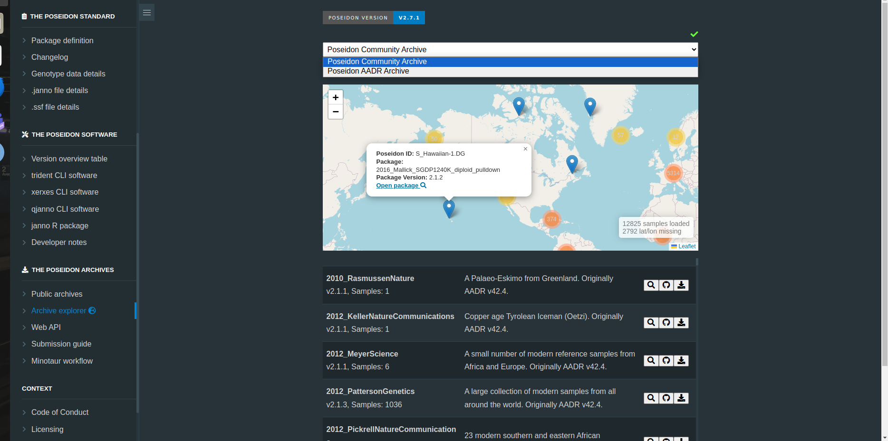
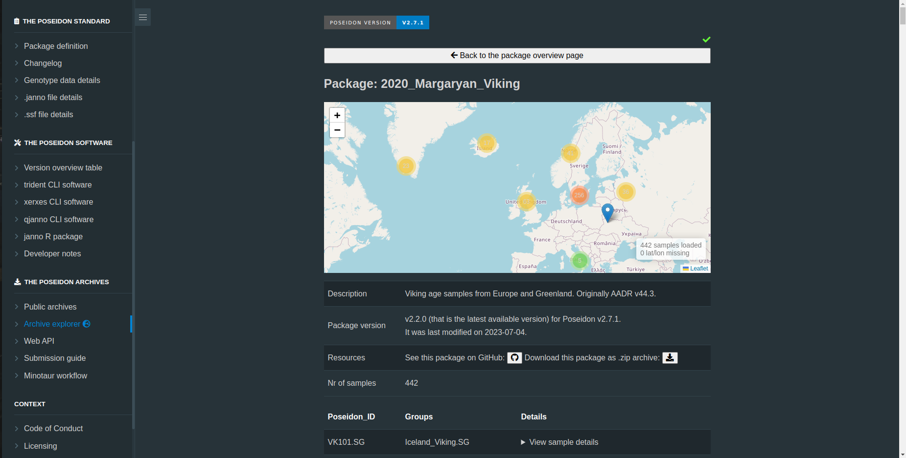
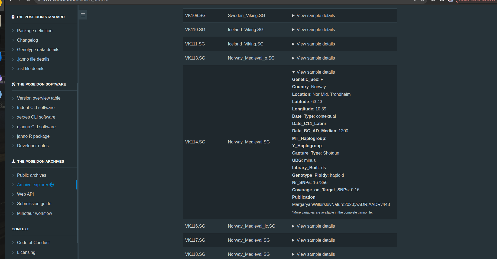

In the ever-evolving world of ancient DNA research, staying up-to-date
with the latest publications and datasets is essential. To address the
challenges faced by researchers in this field, the Poseidon ecosystem
has introduced a new feature - the [Poseidon Archive Explorer](https://www.poseidon-adna.org/#/archive_explorer). This
dynamic web application offers a comprehensive overview of current
Ancient DNA publications, providing a valuable resource for scholars and
enthusiasts alike.

**In the Poseidon ecosystem, there are three main components:**

1.  The Poseidon Package Format: This component serves as a standardized
    framework for organizing genotype data, along with associated meta-
    and contextual information. It offers a structured, yet adaptable,
    format that is easily readable by both humans and machines.

2.  The Poseidon Software: This component encompasses a suite of
    [in-house developed software
    tools](https://www.poseidon-adna.org/#/trident) and the [Poseidon R
    package](https://www.poseidon-adna.org/#/janno_r_package). These
    resources are designed to facilitate the efficient management of
    genotype data, ensuring ease and precision in data handling.

3.  Public repositories : Poseidon currently maintains 3 Public
    repositories. The Poseidon Community Archive, The Poseidon Minotaur
    Archive, and The Poseidon AADR Archive. These repositories are
    carefully organized to store Ancient DNA genotyping data together
    with archaeological and laboratory context information. To learn
    more about each of their specific roles, you can visit [this
    link](https://www.poseidon-adna.org/#/archive_overview)

The Poseidon Ecosystem further underscores its commitment to data
integrity by integrating an in-house web API with the GitHub Large File
Storage system. This hybrid approach ensures robust version control and
data cleanliness. Researchers and enthusiasts can benefit from this
combination, fostering a harmonious ecosystem of data accessibility and
precision.

**A Bridge Between Data and You**

The concept behind the development of Archive Explorer is pretty
straightforward. We’ve been housing all our Poseidon genotype data using
the GIT Large File Storage system (GIT LFS). While that’s all fine and
dandy for version control, we realized we needed something more
interactive and user-friendly to share and visualize this data with the
public. The solution? A dynamic web application built on JavaScript. When
you land on the [Archive Explorer page](https://www.poseidon-adna.org/#/archive_explorer), you’ll notice it’s got some neat
features. Up top, there’s an archive selector. This is your gateway to
choose the specific archive you’re interested in. Then, we’ve thrown in
a world map powered by the Leaflet map plugin because it’s open source
and super easy to use.

This map? It’s not your regular map. It’s more like a bird’s-eye view of
all the genotype data scattered across the globe. You can see data
points from around the world, making it easy to grasp the big picture.

**Three Paths to Poseidon Genotype Data: Take Your Pick**

We give you three different routes to get to the Poseidon genotype data
you’re after:

1.  If you know exactly what you’re looking for, you can type a full or
    partial name in our dynamic search bar and select the package you
    want.

2.  Want to explore data from a specific part of the world? Check out
    the world map, click on a marker, and voila! You’ll see a snapshot
    of what’s in that package, and a link to dive straight into it.

3.  For those who prefer the manual approach, we’ve got a table view of
    all the publications available in each archive. You can roll up your
    sleeves and search for the info you need.

**Getting Up Close and Personal with the Data**

Once you’ve picked a package, you can access it either through the map
marker or by hitting that trusty magnifying glass icon on the table
view. If you’re into details, the table view lets you view genotype data or download it as a "zip" file via our inhouse Poseidon server.

**Exploring the Package: More Than Meets the Eye**

The package view isn’t all that different from the general user
interface, but it’s filtered to show only the markers that are relevant
to that particular publication. And if you want to dig deeper, just
click on each "PoseidonID" to access more detailed genotype information.
We’re also cooking up a new feature to display some informative
descriptive statistics for each publication, giving you a broader
picture of the data. So stay tuned!

In a nutshell, the Archive Explorer is your one-stop shop for navigating
the world of Poseidon genotype data. It’s got the goods for the pros and
is user-friendly enough for the rest of us to dive into the fascinating
realm of ancient DNA research.
